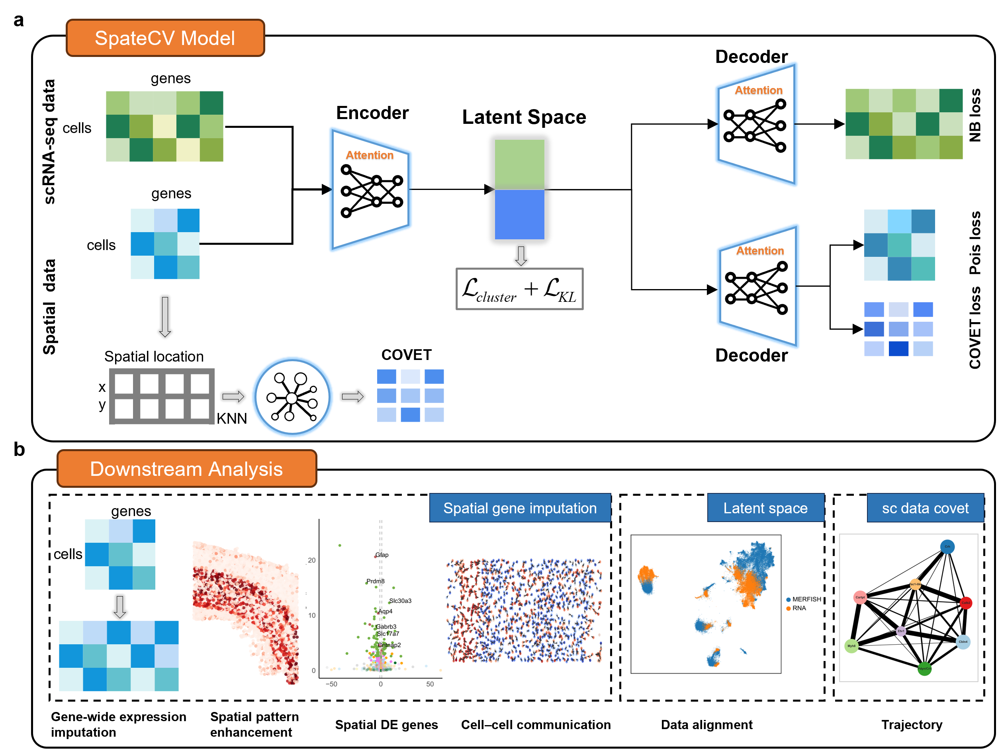

Welcome to SpateCV Tutorials
=========================

SpateCV: An Attention-Enhanced Conditional VAE for Gene Expression Imputation in Spatial Transcriptomics
================================================================================================================================

.. toctree::
   :maxdepth: 1

   notebooks/Installation
   notebooks/Mouse-MOp-MERFISH
   notebooks/Mouse-hypothalamic-MERFISH
   notebooks/integrate
   notebooks/integrate-ablation
   notebooks/Mouse-VISp-STARmap

Overview
========
SpateCV is a unified framework for the joint analysis of scRNA and scST data, enabling the imputation of unmeasured spatial genes and cross-modal alignment.